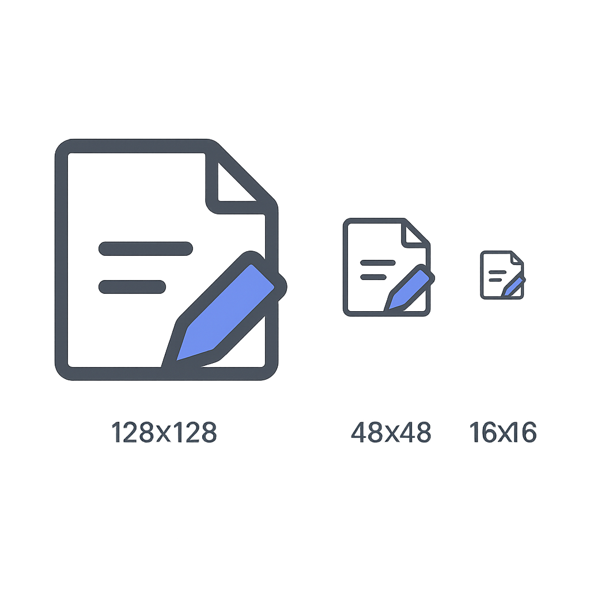

# Vibe Headers

I've been wanting to try to ~~develop~~ build a small application using AI so when I encountered a [defect in OpenSearch](https://github.com/opensearch-project/OpenSearch/issues/17339) that prompted me to look at removing `zstd` from the `Accept-Encoding` header in my browser's requests the idea for the Vibe Header browser extension was born.

I have built a very simple v3 manifest browser extension in the past so I'm confident I could have built a similar extension from scratch but it would have likely taken between one to three full days of development (I'm mostly a back-end developer).

The name for this extension is based on the [Vibe code](https://en.wikipedia.org/wiki/Vibe_coding) technique used. 

## Code Generation

A quick search for what LLM people are using for code generation showed several recommendations for the Gemini 2.5 Pro model. And the price was right, you can use it (with a very limited number of prompts) for free.

Initial prompt:

    Build a v3 manifest Chrome extension that can modify the Accept-Encoding request header.

First refinement:

    Now update it with a simple UI and the ability to modify any header, and the ability to have different rules for different sites.

Second refinement:

    Update it to use urlFilter instead of requestDomains to support path matching in addition to matching the host and support matching against all URLs if no pattern is supplied.

Entire conversation: <https://g.co/gemini/share/24ecbb36bd7f>

Total time creating code: 30 minutes. This includes small changes summarized below.

### Manual Changes

#### manifest.json Comments

I removed three `//` comments Gemini had in the manifest.json file.

#### Extension Name

I changed the name to "Vibe Headers". Gemini changed the name on every refinement. I probably should have specified a name. It went through: 

1. "Accept-Encoding Modifier"
2. "Header Modifier Pro"
3. "Header Modifier Pro (URL Filters)"

I also changed the final version back to 1.0 as Gemini increased the version on every refinement.

### Future Changes

Since my goal was to see how fast vibe coding could solve my problem I wanted to get something out the door as fast as possible. Even some of the refinements weren't required but they made the plug-in more general purpose and took minimal time. Ideas for future changes:

* It might be nice to use [optional_host_permissions](https://developer.mozilla.org/en-US/docs/Mozilla/Add-ons/WebExtensions/manifest.json/optional_host_permissions) with the permissions API in the future to avoid requesting.
* Improve the UI. It is a bit uninspired and small. It's funny because it is kind of the stereotypical UI that a backend developer might create. 
* Edit rules. You can add and remove rules but not edit them.

This would be a nice little test for feeding an existing codebase into an LLM in the future.

## Icon Generation

Because Gemini didn't include any icons and I hit *"You’ve reached your limit on 2.5 Pro"* after my second refinement, I switched to ChatGPT to generate the icons. Gemini did tell me the icons were optional and I could remove the `"icons"` section from the manifest file if I wanted.

Initial prompt: 

    Create an icon available at three resolutions (128x128, 48x48, and 16x16 pixels) that represents a browser extension that can modify HTTP headers. The extension is called Vibe Headers.

Before generating the images ChatGPT asked me about the style and the background.

First refinement for the style:

    Minimalist in the style of Google material design.

Second refinement for the background:

    A transparent background please.

The resulting image was created as a single image. The resolutions were much larger than request but ChatGTP lied about the resolutions in the resulting image.

I pulled the image into Gimp, cropped it to the larger one, added a white file and scaled as needed to produce the images you see in the [images folder](./images/).

Entire conversation: <https://chatgpt.com/share/680e6fad-5a34-8007-b779-318debcc296f>

Total time creating images: 15 minutes.

## Local Testing

The Gemini generated instructions were mostly okay but the refinements tend towards showing deltas instead of complete instructions. Simplified and combined instructions below.

### Loading the Extension in Chrome

1. Open Chrome.
2. Go to chrome://extensions/.
3. Enable "Developer mode" (usually a toggle in the top-right corner).
4. Click "Load unpacked".
5. Navigate to and select the vibe-headers folder.
6. The extension should now appear in your list. Look for any errors reported on the extension card.
7. Click the extension icon in your toolbar to open the popup.
8. Add a rule:
    * URL filter Pattern: *://google.com/* (or leave blank for all sites)
    * Operation: Set Header | Remove Header | Append Header
    * Header Name: Accept-Encoding
    * Header Value: gzip
    * Click "Add Rule".

### Verify Functionality

1. Open Chrome's Developer Tools (F12 or right-click -> Inspect).
2. Go to the "Network" tab.
3. Make sure "Disable cache" is checked (optional, but helps ensure fresh requests).
4. Visit a URL matching your pattern 
5. Click on the main document request in the Network tab (usually the first one, the HTML file).
6. Scroll down in the "Headers" pane to the "Request Headers" section.
7. Inspect a request (like the main document or an image) and check the "Request Headers" section.
8. Try adding rules with remove or append operations and test them.
9. Try deleting rules via the popup and verify they no longer apply.

## Conclusion

I spent 2 hours working on this extension including a 15 minute break. 

* 30 minutes generating, review, and editing code.
* 15 minutes generating icons.
* 1 hour creating the README and pushing the project to GitHub.

I saved a significant amount of time by using AI. Probably the thing I'm most happy with is that I don't have to find an extension I trust from the store. While I didn't write the code myself I reviewed it enough to know that it doesn't send data to third parties.